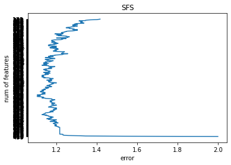

# SFS_and_SBE_Models
Implementation of **Sequential Forward Selection**, and **Sequential Backward Elimination** models on the **Madelon** dataset.

I preprocess the data to normalize it using **MinMaxScaler**, and then split it to train and test sets using **train_test_split**.

<h4>The SFS function:</h4>

I define a **sequential forward selection** function, that chooses the feature with the **minimum mean square of errors** at each iteration, and returns the selected features and list of errors. The function in the above code:

```ruby
def SFS(training_data, testing_data, training_labels, testing_labels)
```

Then I find the minimum error corresponding to **different number of components**.

```ruby
error = mean_squared_error(testing_labels, NB.predict(testing_data[:, index_list]))
```

The results are shown in the graph below:



<h4>The SBE function:</h4>

I define a **sequential backward elimination** function, that chooses the feature with the **max mean square of errors** at each iteration, and returns the selected features to be removed and list of errors as below:

```ruby
def SBE(training_data, testing_data, training_labels, testing_labels)
```

Then I find the minimum error corresponding to different number of components. The results are shown in the graph below:
```ruby
NB = MultinomialNB()
NB.fit(np.delete(training_data, index_list, axis=1), training_labels)
error = mean_squared_error(testing_labels, NB.predict(np.delete(testing_data, index_list, axis=1)))
```


<h4>Comparison of the methods:</h4>

Finally I compare the two algorithms. As it can be seen in the code, the SBE algorithm is **more accurate** since its error is less, and as we see from the running time of both algorithms, the SBE algorithm is **slower**.

The minimum error of each of the methods:

Min error of SFS: 1.104

Min error of SBE: 0
